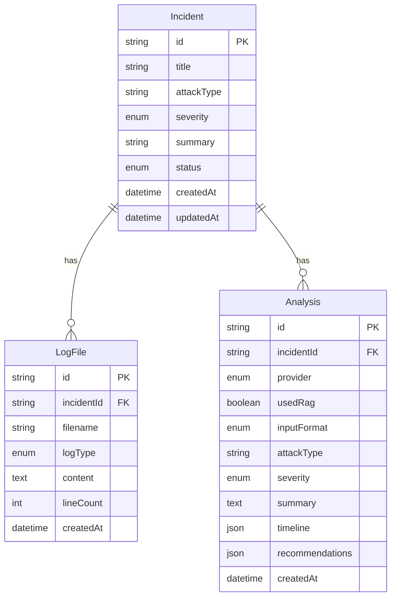

# Data Model

## Entity relationship

## Enums

| Enum | Values |
|------|--------|
| `Severity` | LOW, MEDIUM, HIGH, CRITICAL |
| `IncidentStatus` | OPEN, INVESTIGATING, RESOLVED, ARCHIVED |
| `LogType` | AUTH, FIREWALL, WEB_SERVER, SIEM, OTHER |
| `AiProvider` | GEMINI, OPENAI |
| `InputFormat` | RAW, STRUCTURED |

## Experiment dimensions

Stored on each `Analysis` row:

- `provider` — LLM provider used for analysis (`GEMINI` default)
- `usedRag` — RAG vs baseline (Experiment 2)
- `inputFormat` — Raw vs structured logs (Experiment 3)

## JSON fields

**timeline** — array of `{ timestamp, event, source? }`

**recommendations** — array of investigation step strings

## Indexes

- `Incident.severity`, `Incident.createdAt DESC`
- `LogFile.incidentId`
- `Analysis.incidentId`, `Analysis.(provider, usedRag, inputFormat)`
